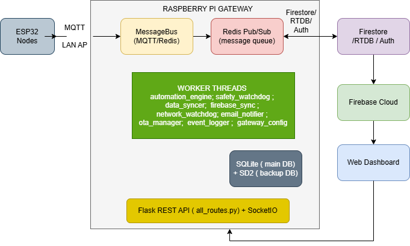

# 🏠 SmartHome Gateway — Raspberry Pi Middleware

Gateway trung tâm (chạy trên **Raspberry Pi**, Python) đóng vai trò cầu nối giữa các node **ESP32** (cảm biến/thiết bị vật lý) và **Firebase Cloud** (Web dashboard). Đây là thành phần lõi của đồ án hệ thống Nhà Thông Minh — nơi xử lý toàn bộ logic tự động hóa, an toàn, đồng bộ dữ liệu và cập nhật firmware từ xa.

> Đồ án 1 — Khoa Đào tạo Chất lượng cao, HCMUTE
> https://youtu.be/iGAsCEW-4ug?feature=shared
> 

---

## 1. Ý tưởng thiết kế

Thay vì để ESP32 giao tiếp trực tiếp với Firebase (tốn tài nguyên, khó bảo mật, không hoạt động khi mất Internet), toàn bộ hệ thống được thiết kế theo mô hình **Edge Gateway**:



**Nguyên tắc cốt lõi:**
- **Message Bus làm xương sống** — mọi thành phần (ESP32, worker, API, Firebase) chỉ giao tiếp qua Redis Pub/Sub, không gọi trực tiếp lẫn nhau → dễ mở rộng, dễ debug, các worker độc lập (crash 1 worker không sập cả hệ thống).
- **Offline-first** — SQLite là nguồn sự thật cục bộ; Firebase chỉ là lớp đồng bộ "khi có mạng". Nhà vẫn hoạt động (automation, an toàn, điều khiển local) khi mất Internet.
- **Safety-first** — các cảnh báo gas/lửa được xử lý ưu tiên tuyệt đối, có cơ chế khóa (safety lock) độc lập với automation thông thường.
- **Zero Trust API** — mọi endpoint có thể lộ dữ liệu nhà đều bắt buộc xác thực token, có blacklist khi logout.

---

## 2. Các thành phần (Workers)

| Module | Vai trò |
|---|---|
| `bridge/message_bus.py` | Cầu nối MQTT ↔ Redis. ESP32 publish MQTT → bus đẩy vào Redis channel `mqtt_inbound`; lệnh điều khiển từ Redis `mqtt_outbound` → publish xuống MQTT cho ESP32. Có cơ chế retry kết nối MQTT và hàng đợi `mqtt_pending_queue` khi mất kết nối. |
| `workers/automation_engine.py` | "Bộ não" trung tâm: nhận dữ liệu cảm biến, quyết định bật/tắt thiết bị theo ngưỡng, quản lý state machine `MANUAL_STATE` (chặn automation ghi đè khi user vừa điều khiển tay), xử lý RFID/xác thực ra-vào cửa, chạy scheduler cho lịch hẹn giờ. |
| `workers/safety_watchdog.py` | Giám sát khí gas/lửa độc lập với automation. Khi phát hiện nguy hiểm: khóa an toàn (`safety_lock`), kích hoạt còi/quạt thông gió, publish alert lên `safety_alert` channel để đẩy lên Firestore + gửi email. Có cơ chế "Smart Mute" (tắt còi 3 phút khi user đã đọc thông báo trên web, tự kêu lại nếu vẫn còn nguy hiểm). |
| `workers/network_watchdog.py` | Quản lý mạng của Pi theo chiến lược **Dual Interface**: `wlan0` luôn là Hotspot cho ESP32 (không đổi), `wlan1` là uplink Internet (đổi thoải mái qua Settings web) — tránh việc đổi WiFi làm rớt toàn bộ node ESP32. Đồng bộ NTP, quét/kết nối WiFi theo yêu cầu từ web. |
| `workers/firebase_sync.py` | Đồng bộ 2 chiều SQLite ↔ Firebase: đẩy dữ liệu cảm biến/sự kiện lên Firestore theo bucket phút (tránh vượt quota ghi), ghi RTDB cho dữ liệu realtime, đồng bộ automation/schedule một chiều có kiểm soát (không cho Firestore ghi đè dữ liệu mới hơn ở SQLite), heartbeat, auto-provisioning thiết bị/phòng mới. |
| `workers/data_syncer.py` + `sd2_direct_writer.py` | Cơ chế **backup database kép (SD2)**: ngoài DB chính, ghi song song một bản sao vào thẻ nhớ thứ hai để chống mất dữ liệu khi hỏng SD card — tự động định tuyến sự kiện (`_infer_event`) vào đúng bảng theo `type` payload. |
| `workers/email_notifier.py` | Gửi email cảnh báo qua Gmail SMTP khi có sự cố nghiêm trọng (gas/lửa/đột nhập), có rate-limit theo phòng, đọc cấu hình **động** (không cần restart gateway). |
| `workers/gateway_config.py` | Đồng bộ cấu hình từ xa (email SMTP...) từ Firestore `system_config`, poll định kỳ, fallback về `.env` nếu mất mạng — cho phép người dùng đổi cấu hình từ Web mà không cần SSH vào Pi. |
| `workers/ota_manager.py` | Quản lý **OTA firmware update**: nhận file upload từ web → ghi Firestore notice → chờ user xác nhận trên dashboard → gửi lệnh MQTT cho ESP32 tải & flash firmware → theo dõi kết quả và tự mở khóa an toàn sau khi OTA xong (đặc biệt xử lý riêng cho node có khóa cửa). |
| `workers/event_logger.py` | Logger tập trung, chuẩn hóa toàn bộ sự kiện hệ thống (schedule, automation, an toàn, ra vào cửa, RFID, wifi, OTA...) ghi vào Firestore `system_alerts` để hiển thị lên trang Thông báo của web. |
| `app/api/routes/all_routes.py` | REST API (Flask Blueprint) phục vụ Web dashboard: auth (session token + blacklist khi logout), CRUD phòng/thiết bị/automation/schedule/RFID, wifi, OTA upload/trigger, xem log/alert — có `require_auth`/`require_admin` decorator bảo vệ endpoint. |
| `main.py` | Khởi tạo Flask app + Flask-SocketIO cho kênh realtime bổ sung ngoài Firebase (CORS mở cho dashboard). |
| `db_schema.sql` | Schema SQLite: users/sessions, rooms/devices, sensor_data, device_status, system_alerts, automations, schedules, rfid_cards, access_logs, ota_logs... |

---

## 3. Vài quyết định kỹ thuật đáng chú ý

- **Manual override có TTL phân tầng**: điều khiển thủ công chặn automation 5 phút; nếu do *schedule* tắt thiết bị thì chặn tới 1 giờ (tránh automation bật lại ngay khi nhiệt độ còn cao) — giải quyết đúng bài toán UX "người dùng vừa tắt thì đừng tự bật lại".
- **Schedule dedup** (`schedule_dedup_patch.py`): dùng cửa sổ 55 giây theo `(device_id, action, phút)` để chống schedule gửi lệnh lặp hàng chục lần/phút khi có nhiều lịch hẹn trùng.
- **Bucket hóa dữ liệu cảm biến theo phút** trước khi ghi Firestore — vừa giảm số lần ghi (tránh cạn quota Firestore free tier) vừa giữ được biểu đồ mượt trên dashboard.
- **Zero Trust API + Token Blacklist**: mọi endpoint nội bộ mạng LAN vẫn yêu cầu xác thực (trừ `/health`, `/firmware/<file>` dành cho ESP32); token bị vô hiệu hóa ngay khi logout thay vì chờ hết hạn.
- **OTA có tích hợp an toàn vật lý**: khi cập nhật firmware node điều khiển khóa cửa, hệ thống tự khóa cửa tạm thời trong lúc flash và tự mở lại khi xong (thành công hoặc thất bại) — tránh cửa ở trạng thái không xác định giữa lúc ESP32 reboot.

---

## 4. Liên hệ với vị trí Kỹ sư Phần mềm Nhúng (Embedded Software Engineer)

Đối chiếu với các yêu cầu công việc thường gặp cho vị trí Fresher/Junior Embedded Software Engineer, phần nào của đồ án đã thực hành/đáp ứng và phần nào là hướng cần bổ sung:

| Yêu cầu JD | Mức độ đã thực hành trong đồ án |
|---|---|
| Lập trình C, C++, Python (test tool, scripting), Shell script | ✅ **Python** cho toàn bộ gateway (workers, Flask API, xử lý đa luồng với `threading`, giao tiếp Redis/MQTT/SQLite/Firestore); **C++** cho firmware ESP32 (3 node: bedroom/kitchen/living room, kiến trúc `NetworkManager`, `MessageBus` phía firmware). |
| Kiến thức về RTOS (FreeRTOS, Zephyr, ThreadX...) | 🟡 ESP32 Arduino framework chạy trên nền **FreeRTOS** (task OTA, MQTT, sensor polling) — đã làm việc gián tiếp qua Arduino API, chưa viết task/queue FreeRTOS thuần thục ở mức low-level. |
| Giao tiếp I2C, SPI, UART, CAN, Ethernet, USB, BLE | 🟡 Đã dùng **UART** (debug/nạp firmware ESP32), cảm biến nhiệt độ/độ ẩm/gas qua chân digital/analog trên ESP32, module RFID qua **SPI**. Chưa có kinh nghiệm với **CAN bus**. |
| Giao thức mạng Ethernet, UDP, TCP | ✅ MQTT chạy trên TCP (`paho-mqtt`), Redis giao tiếp TCP nội bộ, REST API HTTP/TCP (Flask), tự quản lý Access Point (`wlan0`) và giao thức DHCP/WiFi ở tầng OS (`network_watchdog.py`). |
| Bootloader, OTA update, bảo mật firmware | ✅ Đây là phần được đầu tư kỹ nhất: cả **luồng OTA hoàn chỉnh** (upload → notice → user xác nhận → dispatch MQTT → ESP32 tự tải & flash → báo cáo kết quả), có xử lý fail-safe (mở khóa an toàn khi OTA thất bại) và versioning firmware qua RTDB. |
| Tích hợp hệ thống nhúng với Cloud (MQTT, HTTP, WebSocket) | ✅ Đúng trọng tâm của gateway: **MQTT** (ESP32↔Pi), **HTTP REST** (Web↔Pi qua Flask), **WebSocket** (Flask-SocketIO cho realtime bổ sung), cộng thêm **Firestore/RTDB** (Pi↔Cloud) — tức là đã thực hành gần như trọn bộ giao thức tích hợp cloud phổ biến cho thiết bị nhúng. |
| Linux Embedded: Yocto, Buildroot, U-Boot, Device Tree | 🟡 Gateway chạy trên **Raspberry Pi OS** (Debian-based), có cấu hình **systemd service** để tự khởi động/restart, quản lý network interface ở tầng hệ điều hành — nhưng chưa từng build custom Linux image bằng Yocto/Buildroot hay tùy biến Device Tree/U-Boot. Đây là khoảng trống lớn nhất so với JD. |
| Containerization (Docker) | ❌ Chưa áp dụng trong đồ án — dự án hiện chạy trực tiếp trên Pi qua systemd, chưa đóng gói Docker. Là hướng cải tiến tiếp theo (đặc biệt hợp lý cho các worker Python vốn đã tách module rõ ràng, dễ container hóa). |

**Nhận xét chung**: đồ án bám khá sát nhóm kỹ năng "tích hợp hệ thống nhúng với Cloud" và "OTA/bảo mật firmware" — vốn là phần thường bị đánh giá thấp ở ứng viên fresher vì ít được thực hành trong môn học. Điểm cần bổ sung để khớp JD trọn vẹn hơn là mảng **Embedded Linux build system** (Yocto/Buildroot/U-Boot/Device Tree), **RTOS thuần** (viết task/queue trực tiếp thay vì qua Arduino abstraction), và **Docker**.

---

## 5. Cấu trúc thư mục (rút gọn)

```
gateway/
├── main.py                         # Flask + SocketIO entrypoint
├── bridge/
│   └── message_bus.py              # MQTT ↔ Redis bridge
├── workers/
│   ├── automation_engine.py
│   ├── safety_watchdog.py
│   ├── network_watchdog.py
│   ├── firebase_sync.py
│   ├── data_syncer.py
│   ├── email_notifier.py
│   ├── gateway_config.py
│   ├── ota_manager.py
│   ├── event_logger.py
│   └── schedule_dedup_patch.py
├── sd2_direct_writer.py            # Backup DB writer (thẻ nhớ thứ 2)
├── app/api/routes/
│   └── all_routes.py               # REST API cho Web dashboard
├── db_schema.sql                   # Schema SQLite
└── __init__.py
```

---

## 6. Chạy thử (tóm tắt)

```bash
# Yêu cầu: Python 3.10+, Redis server, Mosquitto MQTT broker, Firebase service account key

pip install -r requirements.txt        # flask, flask-socketio, redis, paho-mqtt, firebase-admin...
python main.py                         # khởi động API + các worker (qua systemd trong triển khai thực tế)
```

Cấu hình `.env` (fallback khi chưa có config trên Firestore):
```
EMAIL_USER=...
EMAIL_APP_PASSWORD=...
EMAIL_TO=...
EMAIL_COOLDOWN_SECONDS=600
CONFIG_POLL_INTERVAL_SECONDS=300
```

---

## 7. Thực hiện

| Họ tên | Email |
|---|---|
| Cao Như Ý | 23139052@student.hcmute.edu.vn |
